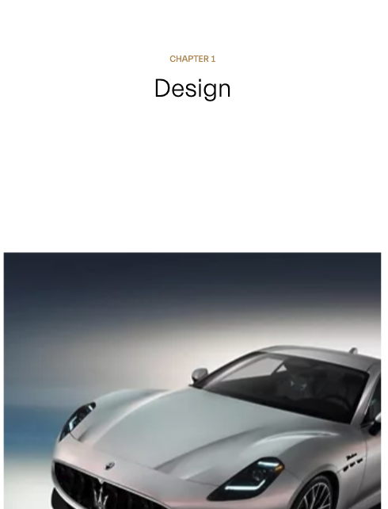

# Procesverslag

Markdown is een simpele manier om HTML te schrijven.  
Markdown cheat cheet: [Hulp bij het schrijven van Markdown](https://github.com/adam-p/markdown-here/wiki/Markdown-Cheatsheet).

Nb. De standaardstructuur en de spartaanse opmaak van de README.md zijn helemaal prima. Het gaat om de inhoud van je procesverslag. Besteedt de tijd voor pracht en praal aan je website.

Nb. Door _open_ toe te voegen aan een _details_ element kun je deze standaard open zetten. Fijn om dat steeds voor de relevante stuk(ken) te doen.

## Jij

  
uitwerken voor kick-off werkgroep

### Auteur:

Chris Donker

#### Je startniveau:

Rood (met uitschieters naar Zwart)

#### Je focus:

Focus: Surface

## Je website

  
uitwerken voor kick-off werkgroep

### Je opdracht:

De Italiaanse autofabrikant <a href="https://www.maserati.com/global/en">Maserati</a>

#### Screenshot(s) van de eerste pagina (small screen):

Home 

#### Screenshot(s) van de tweede pagina (small screen):

Gran Turismo 

#### Screenshot(s) van de navigatie (small screen):

Gran Turismo  

## Toegankelijkheidstest 1/2 (week 1)

  
uitwerken na test in 2e werkgroep

### Bevindingen

Lijst met je bevindingen die in de test naar voren kwamen:

  <ul>
    <li>
      De site van Maserati is echt niet te gebruiken voor mensen die gebruik maken van een screenreader.  De tab werkt niet op de navigatie & afbeeldingen hebben geen alt tekst.
    </li>
    <li>
      De site is een grote heksen ketel aan divs, op plekken waar het heel logisch en handig is om een section of article te zetten of al helemaal om een lijstje te maken staan divs.
    </li>
    <li>
      De site maakt veel gebruik van bewegend beeldmateriaal, materiaal dat uitzichzelf gaat spelen met het geluid aan, en vaak is de knop om het uit te zetten niet zo 123 te vinden.
    </li>
  </ul>

## Breakdownschets (week 1)

  
uitwerken na afloop 3e werkgroep

### Footer:

  

### Dynamisch Slider):

  

### Static Section:

  

## Voortgang 1 (week 2)

  
uitwerken voor 1e voortgang

### Stand van zaken

Deze week ben ik begonnen met het goed zetten van mijn website, ik was hier voor al begonnen met het los ontdekken van
de verschillende sytstemen die ik voor mijn opdracht nodig heb. Na het toepassen van de breakdown schets op de hoofdpagina
,zag ik dat dit betere manier is om mijn html te gaan opstarten.

Hamburger menu (HTML & CSS)
Het hamburger menu is opgeboud uit een drietal span's die zo doormiddel van css gedraaid worden om van een hamburger shape naar een kruis shape te veranderen, en natuurlijk ook weer terug.  

### Agenda voor meeting

samen met je groepje opstellen

| Safa                                | Daan                          | Red                          | Chris            |
| ----------------------------------- | ----------------------------- | ---------------------------- | ---------------- |
| Css selectors                       | foto/beeld schalen per format | Gif/Filmpje Responsive maken | animated sliders |
| Beeld Materiaal van site downloaden | -                             | -                            | scroll animaties |
| -                                   | -                             | -                            | -                |

### Verslag van meeting

hier na afloop snel de uitkomsten van de meeting vastleggen

- punt 1
- punt 2
- nog een punt
- ...

## Voortgang 2 (week 3)

  
uitwerken voor 2e voortgang

### Stand van zaken

Lekker bezig geweest met het maken van verschiullende code pen bestanden om te testen met verschillende functies zonder dat het hoofd bestand breekt.

Daarnaast het vullen van de 2e pagina qua htmml voor 80% voltooid.

### Agenda voor meeting

samen met je groepje opstellen

| Safa              | Red                          | Daan                     | Chris       |
| ----------------- | ---------------------------- | ------------------------ | ----------- |
| over Div's vragen | Keyframes animaties          | Flexbox inconsistencies  | Geen vragen |
| code controleren  | css code herhaling voorkomen | Css en welke je gebruikt |             |
| ...               | ...                          | wanneer grid             | ...         |

### Verslag van meeting

hier na afloop snel de uitkomsten van de meeting vastleggen

- Uitleg voor keyframes was erg handig, hier nog nieuwe dingen van geleerd en weten toe te passen.
- Mijn eigen uitleg voor DIV's weten te kunnen uitleggen

## Toegankelijkheidstest 2/2 (week 4)

  
uitwerken na test in 9e werkgroep

### Bevindingen

Lijst met je bevindingen die in de test naar voren kwamen (geef ook aan wat er verbeterd is):

- Het is nu een stuk makkelijker om door de site van Maserati heen te tabben. voorheen was dit niet zo makkelijk.
- De knoppen onder de lijstjes/sliders geven nu aan waar ze heen gaan wat het makkelijker maakt om te weten wat je aan drukt.

## Voortgang 3 (week 4)

  
uitwerken voor 3e voortgang

### Stand van zaken

Ik ben de afgelopen week veel bezig geweest met het werkend krijgen van de scroll animatie met css alleen, dit is tot nu toe nog niet gelukt, maar ergens heb ik het gevoel dat ik het wel werkend ga krijgen.

Ik ben ook al verder gegaan met mijn tweede pagina daarvan heb ik de structuur al staande en de content plaatsing in zijn 1e fase, het eigen css bestand is al klaar gezet en gekoppeld aan de pagina.

Ik heb nog niet duidelijk nagedacht over welke 5 surface planes er in mijn site komen te zitten, hopelijk heb ik daar binnenkort wel een keuze over gemaakt.

### Agenda voor meeting

samen met je groepje opstellen

| Daan      | Safa               | Red | Chris |
| --------- | ------------------ | --- | ----- |
| Slideshow | animatie css of js | ... | ...   |
| ...       | ...                | ... | ...   |
| ...       | ...                | ... | ...   |

### Verslag van meeting

hier na afloop snel de uitkomsten van de meeting vastleggen

- De vraag over de slideshow voor daan, is deels niet beantwoord. Gelukkig hebben we hem wel in de juiste richting kunnen
  sturen, met behulp van verschillende web pagina's.
- De vraag over animaties van Safa is wel beantwoord, en hierdoor kan zij weer verder met de CMD site.

## Eindgesprek (week 5)

<h2>De surface planes van mijn website</h2>

<h5>Mijn top-punten maar ook mijn diepte-punten</h5>

<h3>Loading</h3>
<ul>
  <li></li>
  <li></li>
  <li></li>
</ul>
  
  
  
  
De page loader is gemaakt om het makkelijk te maken dat alle afbeeldingen zijn ingeladen voor dat de gebruiker
  de pagina kan bezoeken. Ik heb ervoor gekozen om het logo van Maserati centraal neer te zetten. Daarom heen draaien 2
  Maserati auto's dit is een png die ik doormiddel van keyframes roteer.

<h3>DOM Manipulatie</h3>
<ul>
  <li></li>
  <li></li>
  <li></li>
</ul>
<ul>
  <li>></li>
  <li></li>
  <li></li>
  <li></li>
</ul>

Ik manipuleer de DOM door dat ik een lijstje heb die ik doormiddel van flexbox op zijn kant heb gezet en hier een carroussel van heb weten te maken. Onder de lijst staan een aantal specificaties die voor de verschillende auto's net weer iets anders zijn.Daarom heb ik een een script gemaakt waar ik de waardes kan aanpassen. Dit doe ik doormiddel van een intersect observer.

<h3>Custom Properties</h3>
<ul>
  <li></li>
  <li></li>
</ul>

Ik maak natuurlijk gebruik van <em>Custom Properties</em> bij de kleuren zoals gebruikelijk is, maar op sommige plekken maak ik ook gebruik van de properties door de uitlijning vast te zetten. Ik heb ook een custom property gemaakt voor de scroll animatie om daar te kunnen aangeven om welke container het gaat waar naar gekeken moet worden.

<h3>Advanced Positioning</h3>
<ul>
  <li></li>
  <li></li>
  <li></li>
</ul>

Voor advanced Positioning maak ik gebruik van zo goed als alle methodes. Van absolute tot relative, van sticky tot fixed.

<h3>Scroll animaties</h3>
<ul>
  <li></li>
  <li></li>
  <li></li>
  <li></li>
</ul>

De scroll animatie is iets wat op mijn pagina wel een must is, hoe de developers van Maserati het hebben gedaan heb ik geen idee voor. Gellukkig zijn de scroll-driven-animations nieuw in CSS, jammer genoeg weet mijn docent hier net zoveel als ik van aan het begin van het project. Ik heb het gelukkig aan de praat gekregen en hier is te zijn hoe dat is gelukt.

<h3>BlingBling</h3>
<ul>
  <li></li>
  <li></li>
  <li></li>
</ul>
<ul>
  <li></li>
  <li></li>
  <li></li>
  <li></li>
</ul>

Voor de Bling Bling Factor heb ik op mijn site de AUTOKLEUR-inator in werking gesteld. Hierdoor is het als gebruiker heel makkelijk te zien hoe de GranTurismo er in verschillende kleuren uitziet. Voor mij was dit een grote hersen stoe partij, waar ik uiteindelijk van gewonnen heb. Toen ik er mee klaar was dacht ik wel even, heb ik toch mooi gedaan.

<h3>Hamburger zonder JS</h3>
<ul>
  <li></li>
  <li></li>
</ul>
<ul>
  <li></li>
  <li></li>
  <li></li>
</ul>

De hamburger icon, we kennen hem allemaal. Als we hem in een site willen plaatsen, krijgen we al snel de opmerking. "ja maar dan moet ik met Javascript gaan knoeien". Nou dat hoeft dus niet. Ik heb mijn hamburger aan de praat gekregen door hem te animeren met css, en aan/uit te zetten doormiddel van de ":has()" functie die ook nieuw in css te vinden is.

<h5 style="text-align:center">Op de vraag heb ik een lastige site gekozen? Ja dat heb ik</h5>
<h5 style="text-align:center">Maar het is toch ook niet leuk zonder uitdaging</h5>

## Bronnenlijst

  
continu bijhouden terwijl je werkt

Nb. Wees specifiek ('css-tricks' als bron is bijv. niet specifiek genoeg).
Nb. ChatGpT en andere AI horen er ook bij.
Nb. Vermeld de bronnen ook in je code.

1. Voor px naar em convertie (https://www.w3schools.com/tags/ref_pxtoemconversion.asp)
2. Voor het opzetten van Css Grid (https://cssgrid-generator.netlify.app/)
3. Voor hulp bij denk problemen (Sanne 't Hooft)
4. Dropdowns van (https://blog.logrocket.com/making-dropdown-menus-css/)

